# node-express-boilerplate

[](https://github.com/KhaledSaeed18/node-express-boilerplate/actions/workflows/ci.yml)
[](https://github.com/KhaledSaeed18/node-express-boilerplate/actions/workflows/codeql.yml)
[](https://github.com/KhaledSaeed18/node-express-boilerplate/actions/workflows/security.yml)
[](https://opensource.org/licenses/MIT)
[](https://nodejs.org/)
[](https://www.typescriptlang.org/)
[](https://expressjs.com/)
[](https://www.prisma.io/)
[](https://pnpm.io/)
[](https://github.com/KhaledSaeed18/node-express-boilerplate/stargazers)
[](https://github.com/KhaledSaeed18/node-express-boilerplate/forks)
[](https://github.com/KhaledSaeed18/node-express-boilerplate/commits/main)

A production-grade Express.js boilerplate built for teams who want to start shipping without spending weeks on infrastructure. This is not a minimal hello-world starter — it is a fully wired system with layered clean architecture, strict TypeScript, automated security scanning, a complete CI/CD pipeline, Docker support, and structured AI agent instructions so every major coding tool understands the codebase from day one.

---

## Table of Contents

- [Tech Stack](#tech-stack)
- [Quick Start](#quick-start)
- [Project Architecture](#project-architecture)
- [Request Lifecycle](#request-lifecycle)
- [Database Design](#database-design)
- [Authentication and Security](#authentication-and-security)
- [Error Handling](#error-handling)
- [Middleware Pipeline](#middleware-pipeline)
- [Development Workflow](#development-workflow)
- [Git Branching Strategy](#git-branching-strategy)
- [Pre-Commit Hooks](#pre-commit-hooks)
- [Commit Message Convention](#commit-message-convention)
- [CI/CD Pipeline](#cicd-pipeline)
- [Security Automation](#security-automation)
- [Testing](#testing)
- [Code Quality](#code-quality)
- [Containerization](#containerization)
- [AI Agent Compatibility](#ai-agent-compatibility)
- [API Overview](#api-overview)
- [Configuration Reference](#configuration-reference)
- [Contributing and Changelog](#contributing-and-changelog)
- [Contributors](#contributors)
- [Star History](#star-history)

---

## Tech Stack

| Layer | Technology | Version |
| ----- | ---------- | ------- |
| Runtime | Node.js | 22+ |
| Framework | Express | 5 |
| Language | TypeScript | 6 (strict) |
| ORM | Prisma | 7 |
| Database | PostgreSQL | 16 |
| Validation | Zod | 4 |
| Authentication | jsonwebtoken + bcryptjs | latest |
| Logging | Pino + pino-http | latest |
| CSRF | csrf-csrf | 4 |
| API Docs | swagger-ui-express | latest |
| Testing | Vitest + supertest | latest |
| Package Manager | pnpm | 10+ |
| Containerization | Docker + Docker Compose | latest stable |
| CI/CD | GitHub Actions | - |

---

## Quick Start

```bash
# 1. Clone
git clone https://github.com/KhaledSaeed18/node-express-boilerplate.git
cd node-express-boilerplate

# 2. Install dependencies (also installs git hooks via husky)
pnpm install

# 3. Configure environment
cp .env.example .env
# Edit .env and fill in your secrets

# 4. Start the database (Docker)
docker compose up -d

# 5. Run migrations and generate the Prisma client
pnpm prisma:migrate
pnpm prisma:generate

# 6. Seed initial data (optional)
pnpm prisma:db:seed

# 7. Start the development server
pnpm dev
```

The API will be available at `http://localhost:3000/api/v1` and the interactive API documentation at `http://localhost:3000/api-docs`.

For a complete setup guide including environment variable details, Docker teardown, and production deployment, see [CONTRIBUTING.md](CONTRIBUTING.md).

---

## Project Architecture

This boilerplate follows a strict layered clean architecture. Each layer communicates only with the layer directly below it, enforced by interfaces at every boundary.

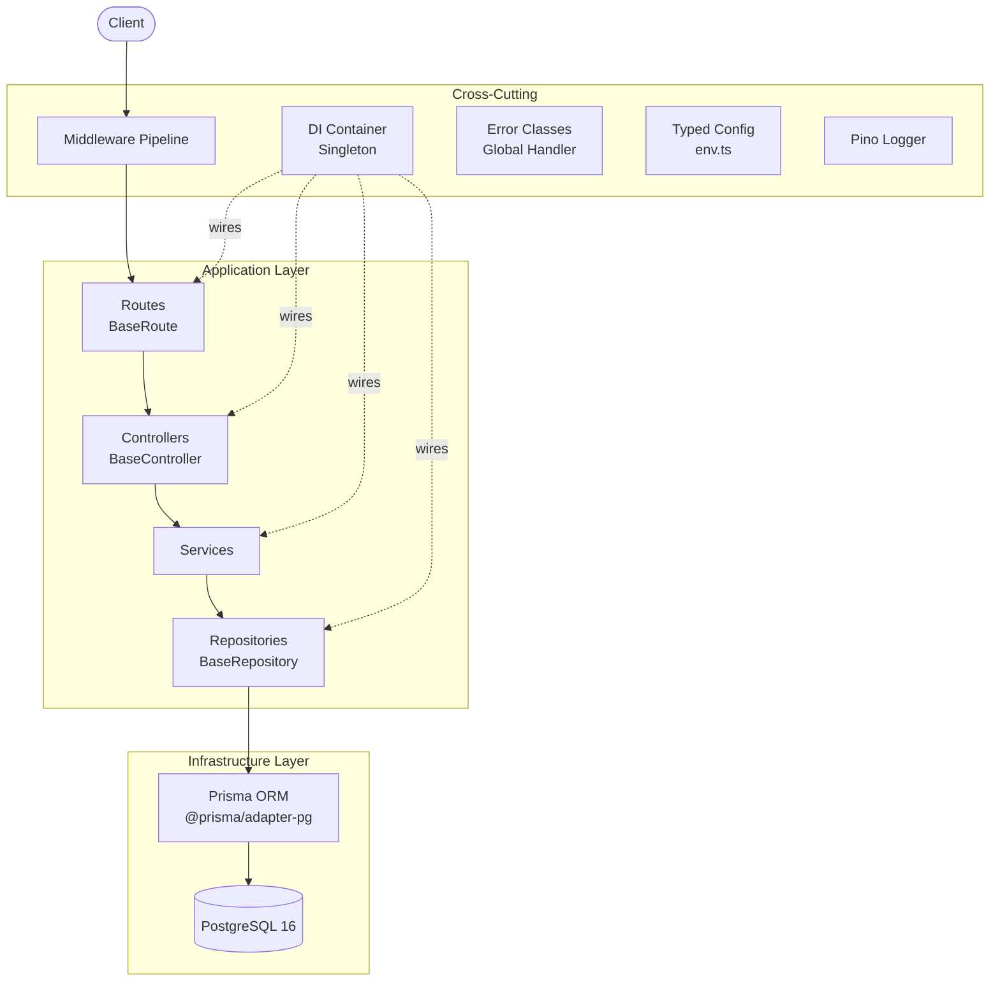

### Directory Structure

```text
.
├── prisma/
│   ├── schema.prisma          # Data model and database config
│   ├── migrations/            # Version-controlled migration files
│   └── seed.ts                # Database seed script
├── src/
│   ├── index.ts               # Port binding only — no app logic
│   ├── app.ts                 # Express setup: middleware chain + route mounting
│   ├── config/
│   │   ├── env.ts             # Typed and validated environment config
│   │   └── logger.ts          # Pino logger instance (pretty dev / JSON prod)
│   ├── container/
│   │   └── index.ts           # DI Container singleton — only place that calls new
│   ├── controllers/
│   │   ├── base.controller.ts # sendResponse, sendPaginatedResponse, handleError
│   │   ├── auth.controller.ts
│   │   └── note.controller.ts
│   ├── database/
│   │   └── prismaClient.ts    # Prisma client initialization with pg adapter
│   ├── docs/
│   │   ├── index.ts           # OpenAPI spec assembly
│   │   ├── schemas.ts         # Reusable response/request schemas
│   │   ├── setup.ts           # swagger-ui-express router
│   │   └── paths/             # Per-resource path definitions
│   ├── errors/
│   │   └── index.ts           # AppError hierarchy
│   ├── lib/
│   │   └── validate.ts        # validateBody() Zod middleware factory
│   ├── middleware/
│   │   ├── auth.middleware.ts       # JWT protect guard
│   │   ├── correlation.middleware.ts # Correlation ID injection
│   │   ├── csrf.middleware.ts        # CSRF token generation
│   │   ├── error.middleware.ts       # Global error handler
│   │   ├── httpLogger.middleware.ts  # pino-http request logging
│   │   ├── limiter.middleware.ts     # Per-route rate limiters
│   │   └── pagination.middleware.ts  # Pagination query parser
│   ├── repository/
│   │   ├── base.repository.ts  # findManyWithPagination, count, handlePrismaError
│   │   ├── user.repository.ts
│   │   └── note.repository.ts
│   ├── routes/
│   │   ├── base.route.ts       # Container initialization, router setup
│   │   ├── auth.routes.ts
│   │   ├── note.routes.ts
│   │   └── health.routes.ts
│   ├── services/
│   │   ├── auth.service.ts
│   │   └── note.service.ts
│   ├── types/
│   │   └── index.ts            # DTOs, AuthPayload, shared interfaces
│   ├── utils/
│   │   ├── generateToken.ts    # JWT access + refresh token generation
│   │   ├── userNames.ts        # Deterministic username generator
│   │   └── time.ts             # Time utility helpers
│   └── validations/
│       ├── auth.validation.ts
│       └── note.validation.ts
├── tests/
│   ├── unit/                   # Service-layer tests with mocked repositories
│   ├── integration/            # Full HTTP cycle tests via supertest
│   └── helpers/                # globalSetup, setup, test utilities
├── .claude/
│   └── skills/                 # Claude Code slash-command workflows
├── .cursor/rules/              # Cursor IDE rules
├── .github/
│   ├── workflows/              # CI, CodeQL, Security pipelines
│   ├── copilot-instructions.md
│   └── ISSUE_TEMPLATE/
├── docker-compose.yml          # Development database (port 5433)
├── docker-compose.test.yml     # Ephemeral test database (port 5434)
├── CLAUDE.md                   # Claude Code instructions
├── GEMINI.md                   # Gemini CLI instructions
├── AGENTS.md                   # OpenAI Codex / ChatGPT instructions
└── .windsurfrules             # Windsurf IDE instructions
```

### The DI Container

`Container` is a singleton (`src/container/index.ts`) and is the only place in the entire codebase where `new Repository/Service/Controller()` is called. Routes access instances through getter methods, keeping all construction logic in one traceable location.

The initialization order is always: Prisma client → Repositories → Services → Controllers.

---

## Request Lifecycle

Every inbound request passes through the following stages before a response is sent:

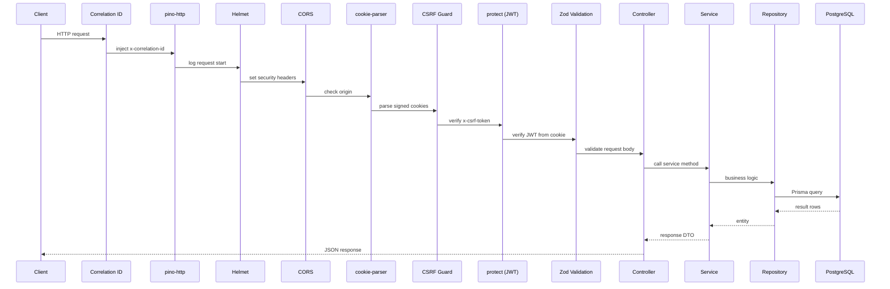

On error at any stage, the middleware calls `next(error)` and the global error handler in `src/middleware/error.middleware.ts` formats the response consistently based on the thrown `AppError` subclass.

---

## Database Design

### Entity Relationship Diagram

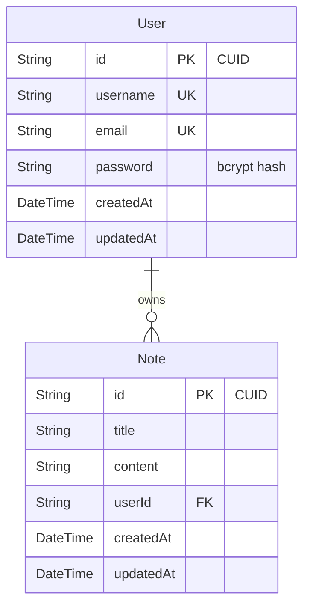

### Schema Notes

- All primary keys use `cuid()` for collision-resistant, sortable, non-sequential IDs.
- `notes.userId` carries `onDelete: Cascade` — deleting a user removes all their notes atomically.
- `@@index([userId])` and `@@index([title])` on the `Note` model cover the most common query patterns.
- Prisma generates the client into `src/generated/prisma/` in CJS module format.
- Table names are mapped to snake_case (`@@map("users")`, `@@map("notes")`).

### Migrations

All schema changes go through Prisma migrations. Migration files are version-controlled and applied in order. The production command `pnpm prisma:migrate:deploy` is non-interactive and safe for CI/CD pipelines.

```bash
pnpm prisma:migrate          # Create and apply (dev)
pnpm prisma:migrate:deploy   # Apply pending only (production / CI)
pnpm prisma:migrate:reset    # Wipe and re-run all (dev reset)
pnpm prisma:generate         # Regenerate client after schema changes
pnpm prisma:studio           # GUI at http://localhost:5555
```

---

## Authentication and Security

### Token Strategy and Cookie Configuration

Access tokens are short-lived (default 15 minutes). Refresh tokens are long-lived (default 7 days). Both are stored exclusively in signed `HttpOnly` cookies — they are never exposed in response bodies or accessible via JavaScript.

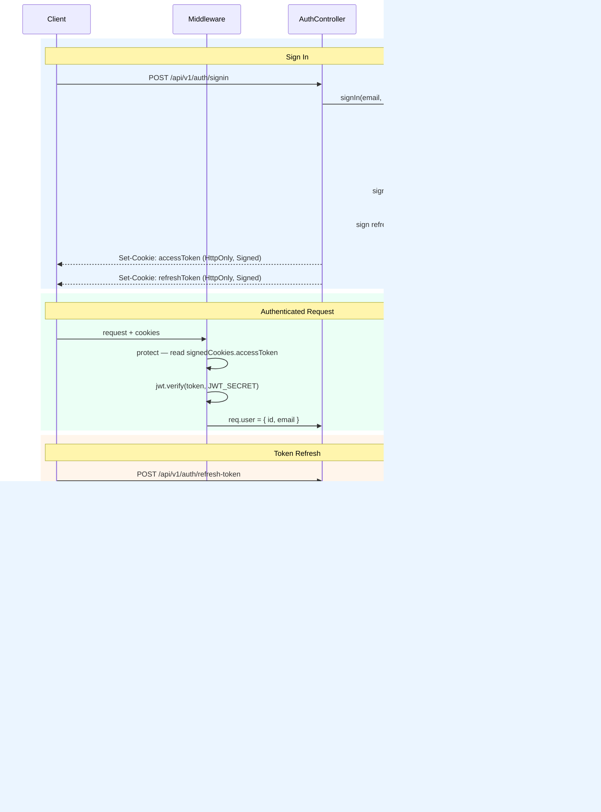

### CSRF Double-Submit Pattern

All state-mutating endpoints (`POST`, `PUT`, `PATCH`, `DELETE`) are protected by `csrf-csrf`. The client must:

1. Call `GET /api/v1/auth/csrf-token` to receive a token.
2. Include it as the `x-csrf-token` request header on every mutating request.

The middleware validates the token by comparing a signed hash (keyed with `COOKIE_SECRET`) stored in a cookie against the submitted header value. The Swagger UI at `/api-docs` is mounted before CSRF middleware so its `GET` requests are not challenged.

### Security Headers

`helmet` is applied to every route. The `/api-docs` route uses a relaxed Content Security Policy that permits the inline scripts and styles required by `swagger-ui-express`. All other routes use the strict default policy.

```text
Strict-Transport-Security
X-Content-Type-Options: nosniff
X-Frame-Options: SAME-ORIGIN
X-XSS-Protection: 0 (disabled — CSP is the correct defense)
Content-Security-Policy: default-src 'self'
```

### Rate Limiting

Each route group has its own `express-rate-limit` instance configured in `src/middleware/limiter.middleware.ts`. Limits are applied per real client IP, with `trust proxy: 1` set so the correct IP is read from the `X-Forwarded-For` header when running behind a reverse proxy.

---

## Error Handling

All errors are thrown as instances of `AppError` subclasses and caught by the global handler in `src/middleware/error.middleware.ts`. Controllers never call `res.status().json()` directly on error paths.

### Error Class Hierarchy

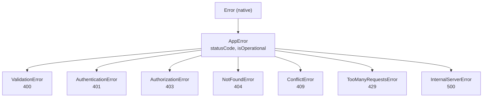

### Error Response Shape

```json
{
  "statusCode": 400,
  "message": "Validation failed",
  "errors": [
    { "field": "email", "message": "Invalid email format" }
  ]
}
```

The `stack` field is included only when `NODE_ENV=development`. `isOperational: false` errors (unexpected crashes) are logged at `error` level by Pino and return a generic 500 response without internal details.

### Prisma Error Mapping

`BaseRepository.handlePrismaError()` intercepts Prisma client known request errors and converts them to typed `AppError` subclasses before they propagate. `P2025` (record not found) becomes `NotFoundError`, `P2002` (unique constraint violation) becomes `ConflictError`, and so on.

---

## Middleware Pipeline

The middleware chain in `src/app.ts` runs in this exact order for every request:

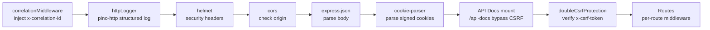

Per-route middleware applied inside route handlers:

| Middleware | Applied to |
| --------- | ---------- |
| `protect` | All authenticated endpoints |
| `rateLimiter` | Every route group |
| `doubleCsrfProtection` | All mutating routes |
| Zod `validateBody()` | POST / PUT / PATCH routes |

---

## Development Workflow

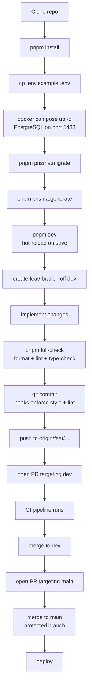

### All Development Commands

```bash
pnpm dev                      # Start with hot reload (nodemon)
pnpm build                    # Compile TypeScript to dist/
pnpm start                    # Run compiled output

pnpm full-check               # format:check + lint:check + type-check
pnpm format                   # Prettier auto-fix
pnpm lint                     # ESLint auto-fix
pnpm type-check               # tsc --noEmit (src)
pnpm type-check:test          # tsc --noEmit (tests)
pnpm type-check:node          # tsc --noEmit (prisma config)

pnpm prisma:migrate           # Create and apply migration (dev)
pnpm prisma:migrate:deploy    # Apply pending migrations (production)
pnpm prisma:migrate:reset     # Wipe and re-run all migrations
pnpm prisma:generate          # Regenerate Prisma client
pnpm prisma:studio            # GUI at http://localhost:5555
pnpm prisma:db:seed           # Seed initial data
pnpm prisma:validate          # Validate schema file

pnpm test                     # Unit tests
pnpm test:watch               # Unit tests in watch mode
pnpm test:coverage            # Unit tests with coverage report
pnpm test:integration         # Integration tests (requires test DB)
pnpm test:all                 # All test suites

pnpm db:test:up               # Start test database (Docker, port 5434)
pnpm db:test:down             # Stop and remove test database
pnpm db:test:migrate          # Apply migrations to test database
```

---

## Git Branching Strategy

`main` is the production branch and is fully protected — no direct pushes are allowed. All work flows through `dev` first.

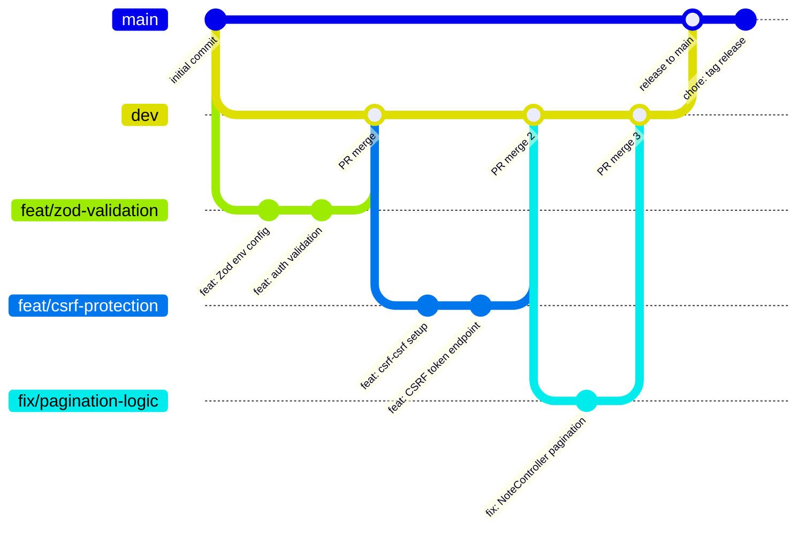

| Branch pattern | Purpose |
| -------------- | ------- |
| `main` | Production, protected |
| `dev` | Integration target for all work |
| `feat/<description>` | New features |
| `fix/<description>` | Bug fixes |
| `refactor/<description>` | Refactoring |
| `docs/<description>` | Documentation |
| `chore/<description>` | Maintenance |
| `ci/<description>` | CI/CD changes |

---

## Pre-Commit Hooks

Git hooks are managed by `husky` and installed automatically on `pnpm install`. Every commit passes through two hooks:

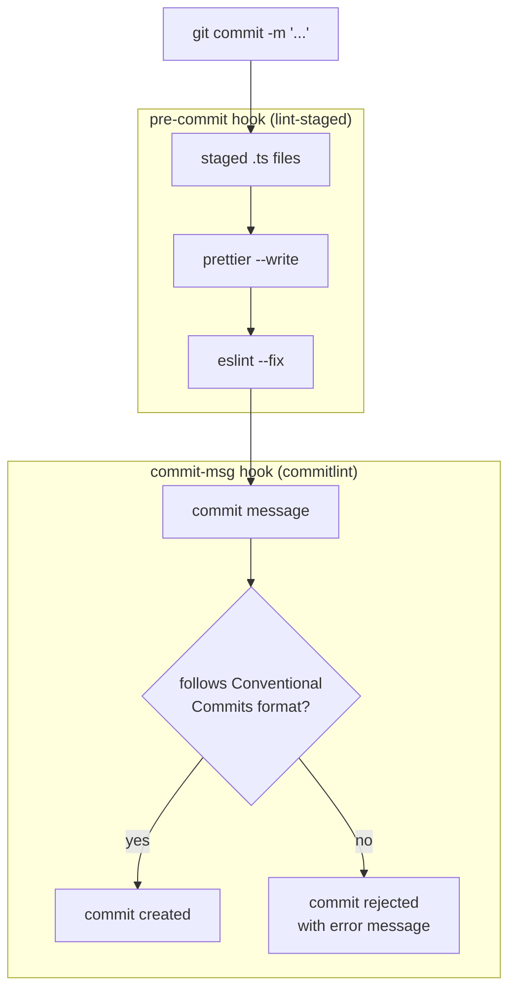

`lint-staged` runs only on staged files, so large codebases are not penalized. `commitlint` validates against `@commitlint/config-conventional`.

---

## Commit Message Convention

This project enforces [Conventional Commits](https://www.conventionalcommits.org/) via `commitlint`. The format is:

```text
<type>(<optional scope>): <subject>

<optional body>

<optional footer>
```

| Type | When to use |
| ---- | ----------- |
| `feat` | New feature |
| `fix` | Bug fix |
| `docs` | Documentation only |
| `style` | Formatting, whitespace |
| `refactor` | No fix, no feature |
| `perf` | Performance improvement |
| `test` | Tests |
| `build` | Build system or dependencies |
| `ci` | CI configuration |
| `chore` | Maintenance |
| `revert` | Reverts a prior commit |

Rules enforced: lowercase type, no trailing period, no title-case subject, header max 100 characters, body lines max 300 characters.

---

## CI/CD Pipeline

Three independent GitHub Actions workflows run on every push and pull request.

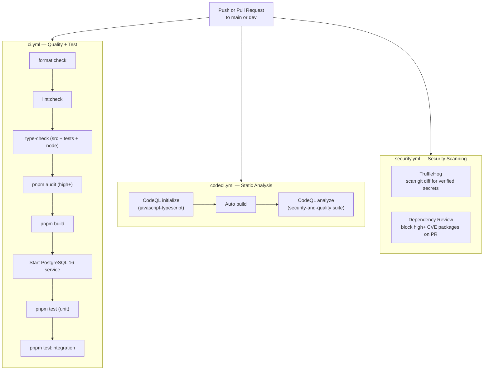

The `quality` job and `test` job in `ci.yml` run sequentially — tests only execute if the quality checks pass. The CodeQL and security workflows run in parallel with CI.

All workflows use concurrency groups with `cancel-in-progress: true` so redundant runs are cancelled immediately when a new push supersedes them.

---

## Security Automation

### CodeQL Static Analysis

CodeQL runs on every push, pull request, and on a weekly schedule (Mondays at 03:00 UTC). The `security-and-quality` query suite covers SQL injection, path traversal, prototype pollution, and dozens of other vulnerability classes. A custom suppression configuration in `.github/codeql/codeql-config.yml` silences the false positive that CodeQL raises on the CSRF token endpoint.

### TruffleHog Secret Scanning

TruffleHog scans the git diff on every push and pull request, checking only newly introduced commits. The `--only-verified` flag means it actively verifies that discovered credentials actually authenticate against the target service before flagging them, keeping false-positive noise low.

### Dependency Review

On every pull request, the dependency review action compares the dependency graph before and after the PR and surfaces packages with CVSS scores of `high` or above (sourced from the GitHub Advisory Database). It posts an inline PR comment summarizing flagged packages and fails the check if any are found.

### Dependabot

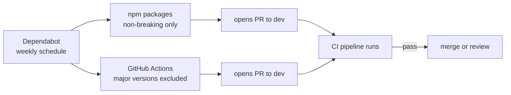

`pnpm audit` also runs in the CI quality job with `--audit-level=high`, catching vulnerabilities in already-installed packages before a deployment.

---

## Testing

The test suite is split into two independent layers. Both use Vitest and are configured separately.

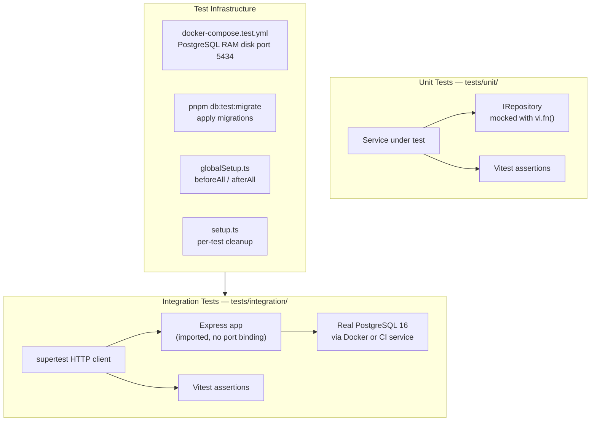

### Unit Tests

Unit tests cover the service layer in isolation. The repository is replaced with a full `vi.fn()` mock, so no database connection is required. Tests run with `pnpm test` and complete in milliseconds.

Coverage thresholds are enforced by Vitest:

| Metric | Threshold |
| ------ | --------- |
| Lines | 80% |
| Functions | 85% |
| Branches | 75% |
| Statements | 80% |

### Integration Tests

Integration tests cover the full HTTP cycle from the HTTP method and path down to the database and back. They use `supertest` against the real Express application (imported without port binding) connected to a dedicated test PostgreSQL instance.

The test database uses in-memory storage so it is wiped clean on every container restart. `fileParallelism: false` serializes test files to prevent concurrent mutations on the shared test schema.

Coverage thresholds for integration tests:

| Metric | Threshold |
| ------ | --------- |
| Lines | 70% |
| Functions | 75% |
| Branches | 65% |
| Statements | 70% |

Every integration test validates at minimum: valid request (happy path), invalid input (400), unauthenticated request (401), missing CSRF token (403), and resource not found (404).

---

## Code Quality

The following tools are configured and enforced:

| Tool | Configuration | When it runs |
| ---- | ------------- | ------------ |
| Prettier | `.prettierrc` | pre-commit (lint-staged), CI |
| ESLint | `eslint.config.mjs` | pre-commit (lint-staged), CI |
| TypeScript | `tsconfig.json` (strict) | pre-commit (type-check), CI |
| commitlint | `commitlint.config.cjs` | commit-msg hook |
| Vitest | `vitest.unit.config.ts` / `vitest.integration.config.ts` | CI test job |

ESLint rules enforced beyond the standard recommended set:

- No `any` type — use `unknown` and narrow explicitly
- All type-only imports must use `import type`
- Explicit return types on all public methods
- No floating promises — all async calls must be awaited or rejection handled
- Prefer `??` over `||` for nullish coalescing

Formatting conventions: 4-space indent, single quotes, semicolons, trailing commas, 100-character line limit.

---

## Containerization

### Development Database

`docker-compose.yml` starts a PostgreSQL 16 instance on port **5433** (deliberately offset from the default 5432 to avoid conflicts with any locally installed Postgres).

```bash
docker compose up -d         # start in background
docker compose down          # stop, keep volume
docker compose down -v       # stop and delete volume
```

### Test Database

`docker-compose.test.yml` starts a separate PostgreSQL 16 instance on port **5434** using in-memory storage. The database is wiped every time the container restarts, giving each test run a guaranteed clean state.

```bash
pnpm db:test:up              # start test DB
pnpm db:test:migrate         # apply migrations to test DB
pnpm test:integration        # run tests against it
pnpm db:test:down            # stop and remove
```

### Production Docker

The included `Dockerfile` is a multi-stage build. The application compiles TypeScript in the build stage and runs the compiled output from `dist/` in the final stage. Prisma migrations are applied separately via `pnpm prisma:migrate:deploy` before starting the container.

---

## AI Agent Compatibility

This boilerplate is structured to be understood by AI coding tools out of the box. Rather than leaving agents to infer architecture from code exploration, every major tool has a dedicated instruction file that communicates the system design, hard rules, and code patterns it needs to generate correct contributions without review cycles.

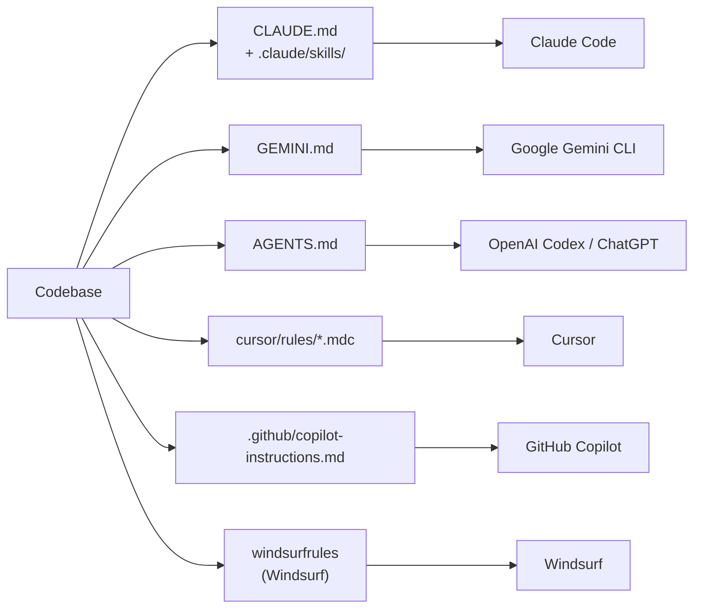

Each file teaches the agent the same core knowledge: the layered architecture, the DI container pattern, the hard rules (`no process.env`, `no console.*`, `no any`, `no direct res.json() on errors`), the Zod validation pattern, and the correct way to throw errors.

### Claude Code Skills

Claude Code has four slash-command skills in `.claude/skills/` that automate the most common multi-step tasks:

| Skill | What it does |
| ----- | ------------ |
| `/new-resource` | Scaffolds a complete resource across all 8 layers — schema, types, validation, repository, service, controller, route, container wiring, OpenAPI, and tests |
| `/add-middleware` | Creates a middleware file and wires it into the pipeline at the correct position |
| `/add-test` | Scaffolds unit tests and integration tests for an existing resource |
| `/update-schema` | Edits the Prisma schema, runs migration, regenerates the client, and updates all affected layers |

This means an agent can add a fully wired, tested, documented resource to the API by running a single skill instead of constructing the sequence from first principles each time.

---

## API Overview

The full interactive API documentation is available at `http://localhost:3000/api-docs` when the server is running. The OpenAPI spec is maintained in `src/docs/`.

Base URL: `http://localhost:3000/api/v1`

| Group | Endpoints |
| ----- | --------- |
| Health | `GET /health` |
| Auth | `GET /auth/csrf-token`, `POST /auth/signup`, `POST /auth/signin`, `POST /auth/refresh-token`, `POST /auth/logout` |
| Notes | `POST /note`, `GET /note`, `GET /note/:id`, `PUT /note/:id`, `DELETE /note/:id` |

All mutating endpoints require a valid CSRF token passed as `x-csrf-token`. All note endpoints require a valid access token cookie from a prior sign-in.

Standard response envelope:

```json
{
  "statusCode": 200,
  "message": "Notes retrieved successfully",
  "data": [],
  "pagination": {
    "totalItems": 42,
    "totalPages": 5,
    "currentPage": 1,
    "pageSize": 10,
    "hasNext": true,
    "hasPrevious": false
  }
}
```

---

## Configuration Reference

Copy `.env.example` to `.env` before running locally.

| Variable | Required | Default | Description |
| -------- | -------- | ------- | ----------- |
| `NODE_ENV` | No | `development` | Controls log format, error detail, and security options |
| `PORT` | No | `3000` | HTTP server port |
| `API_VERSION` | No | `v1` | Injected into every route prefix |
| `BASE_URL` | No | `/api` | Route prefix |
| `DATABASE_URL` | Yes | - | Full PostgreSQL connection string |
| `JWT_SECRET` | Yes | - | Minimum 32 characters |
| `JWT_REFRESH_SECRET` | Yes | - | Minimum 32 characters, different from `JWT_SECRET` |
| `JWT_EXPIRE_TIME` | No | `15m` | Access token TTL (zeit/ms format) |
| `JWT_REFRESH_EXPIRE_TIME` | No | `7d` | Refresh token TTL (zeit/ms format) |
| `CLIENT_URL` | Yes | - | Allowed CORS origin |
| `BCRYPT_SALT_ROUNDS` | No | `12` | bcrypt cost factor (10-15) |
| `COOKIE_SECRET` | Yes | - | Minimum 32 characters, used for cookie signing and CSRF token verification |

All variables are validated at startup via Zod in `src/config/env.ts`. The application exits immediately with a descriptive error if any required variable is missing or fails its constraint.

---

## Contributing and Changelog

For setup instructions, branch rules, commit format, testing setup, and the full pre-merge checklist, see [CONTRIBUTING.md](CONTRIBUTING.md).

For a detailed record of every change made during the 2026 revival including dependency upgrades, security additions, and architectural changes, see [CHANGELOG.md](CHANGELOG.md).

To report a bug or request a feature, use the issue templates in `.github/ISSUE_TEMPLATE/`.

---

## Contributors

[](https://github.com/KhaledSaeed18/node-express-boilerplate/graphs/contributors)

---

## Star History

[](https://www.star-history.com/?repos=KhaledSaeed18%2Fnode-express-boilerplate&type=date&legend=top-left)
